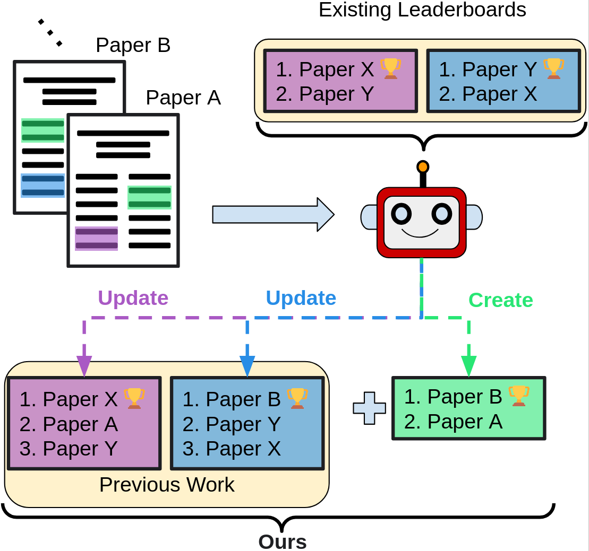

# Efficient Performance Tracking: Leveraging Large Language Models for Automated Construction of Scientific Leaderboards

<p align="center">
  
<p align="center">

This repository contains code and resources related to the paper "[Efficient Performance Tracking: Leveraging Large Language Models for Automated Construction of Scientific Leaderboards](https://arxiv.org/abs/2409.12656)" at EMNLP 2024 main conference.

> **Abstract:** Scientific leaderboards are standardized ranking systems that facilitate evaluating and comparing competitive methods. Typically, a leaderboard is defined by a task, dataset, and evaluation metric (TDM) triple, allowing objective performance assessment and fostering innovation through benchmarking. However, the exponential increase in publications has made it infeasible to construct and maintain these leaderboards manually. Automatic leaderboard construction has emerged as a solution to reduce manual labor. Existing datasets for this task are based on the community-contributed leaderboards without additional curation. Our analysis shows that a large portion of these leaderboards are incomplete, and some of them contain incorrect information. In this work, we present SciLead, a manually-curated Scientific Leaderboard dataset that overcomes the aforementioned problems. Building on this dataset, we propose three experimental settings that simulate real-world scenarios where TDM triples are fully defined, partially defined, or undefined during leaderboard construction. While previous research has only explored the first setting, the latter two are more representative of real-world applications. To address these diverse settings, we develop a comprehensive LLM-based framework for constructing leaderboards. Our experiments and analysis reveal that various LLMs often correctly identify TDM triples while struggling to extract result values from publications. We provide the code and dataset in the supplementary material.

✉️ Contact person: Furkan Şahinuç, [furkan.sahinuc@tu-darmstadt.de](mailto:furkan.sahinuc@tu-darmstadt.de)

[UKP Lab](https://www.ukp.tu-darmstadt.de/) | [TU Darmstadt](https://www.tu-darmstadt.de/)

Don't hesitate to send us an e-mail or report an issue, if something is broken (and it shouldn't be) or if you have further questions.

## General Framework

The aim of the project is to extract <Task,Dataset,Metric,Result> (TDMR) tuples from PDFs of NLP papers and create leaderboards. We process PDF documents by extracting relevant text chunks and tables from papers. Then, we extract TDMR tuples from processed documents by using LLMs. 

In the second step, we normalize TDM tuples to construct leaderboards since papers can use different wordings for the tasks. Normalization is simply mapping different task, dataset, metric names to gold ones. We have 3 normalization steps: `(1) Fully Pre-defined TDM Triples (2) Partially Pre-defined TDM Triples. (3) Cold Start.` In partially pre-defined setting, we mask some of the task and dataset names to simulate newly introduced task, datasets in the literature. In cold start setting, we mask all names to implement normalization based on relative similarities with respect to each other.

## Requirements

```
conda create -n leaderboard_generation python=3.11
conda activate leaderboard_generation
pip install -r requirements.txt
```
We use [unstructured](https://docs.unstructured.io/open-source/introduction/quick-start) library to process PDF files. In order to utilize it in our experiments, along with its python installation ```pip install "unstructured[all-docs]"```, other system dependencies like [tesseract](https://tesseract-ocr.github.io/tessdoc/Installation.html) and [poppler](https://anaconda.org/conda-forge/poppler) must be installed as well.

From nltk library, ```punkt```, ```averaged_perceptron_tagger``` should be also installed.

## SciLead Dataset

We propose SciLead dataset including annotated Task, Dataset, Metric, Result values (TDMR) from NLP papers. You can reach the dataset by following this [link](https://tudatalib.ulb.tu-darmstadt.de/handle/tudatalib/4345).

## Project structure

Project structure can be found below. Each script is explained in the following sections.

```
.
├── doc_preprocess.py
├── doc_preprocess_config.py
├── leaderboard_eval.py
├── leaderboard_llm_normalization.py
├── model_init.py
├── pdf_loader.py
├── prompting.py
├── prompts.json
├── tdm_embedding_normalization.py
├── tdm_eval.py
├── tdm_extraction.py
├── tdm_extraction_config.py
├── tdm_llm_masked_normalization.py
├── tdm_llm_normalization.py
├── utils.py
├── LICENSE
├── logo.png
├── NOTICE
├── README.md
└── requirements.txt 
```


## Pre-processing Papers

In this step, the papers from SciLead needs to be downloaded via links provided in the dataset. Then, PDF files can be pre-processed to extract relevant chunks from main text as well as table information and save them. Therefore, the same pre-processed documents can be used for TDMR extraction process by different LLMs without additional computational overhead. You can simply run following command to preprocess PDF files and save relevant text chunks and tables. 

```
python doc_preprocess.py --process_id "an identifier for process" --papers_path /path/to/papers --output_path /path/to/output
```

Parameter explanation:

* ```process_id```
  * A process id that is determined by you.

* ```papers_path```
  * Path to folder including PDF of papers.

* ```prompt_file```
  * Path to the prompt file. Default file is prompts.json

* ```output_path```
  * Path where processed documents are saved.


## TDMR Extraction

You can simply run following command to extract TDMR tuples from pre-processed files (directly from PDFs files is also possible) via LLMs. Output of this code will be ```output.json``` file including TDMR extraction along with source documents and ```config.json``` including experimental details. 

```
python tdm_extraction.py --env_file_path /path/to/env/file --exp_id "an identifier for exp" --processed_docs_path /path/to/processed_docs --papers_path /path/to/papers --prompt_file prompts.json --output_path /path/to/output --model_type "chosen model type" --model_version "version of the model" --depl "version of the model" -- model_path /path/to/model --is_preprocessed_doc
```

Parameter explanation:

* ```env_file_path``` 
  * If you use GPT-4 Turbo, please specify the environment file path including AZURE_OPENAI_API_KEY and AZURE_OPENAI_ENDPOINT information. 

* ```exp_id```
  * An experiment identifier determined by user.

* ```processed_docs_path```
  * If you use preprocessed documents, please specify saved file path. Otherwise, use empty string.

* ```papers_path```
  * If you use PDF documents directly, please specify folder path including paper PDFs. Otherwise, use empty string.

* ```prompt_file```
  * Path to the prompt file. Default file is prompts.json

* ```output_path```
  * Path where extraction outputs are saved.

* ```model_type```
  * Type of the model that will be used in experiments. Please select one of the following options: {llama-2-chat-70b, Mixtral-8x7B-Instruct-v0.1, llama-3-instruct-70b, gpt4-turbo-128k}

* ```model_version```
  * Model version of GPT-4 Turbo (e.g., 1106-Preview). If you use open models, use empty string.

* ```deployment_name```
  * Deployment name depending on your API specifications. If you use open models, use empty string. 

* ```model_path```
  * Model path for the selected open model. Please use local path or compatible huggingface name. If you use GPT-4 Turbo, use empty string. 

* ```is_preprocessed_doc```
  * Pass this flag if you use preprocessed documents.

* ```is_few_shot```
  * Pass this flag if you use few-shot prompting. 

* ```max_new_tokens```
  * Maximum number of new generated tokens. Default value is 1024.

* ```seed```
  * Seed value for reproducibility. Default value is 0.

  
## Fully Pre-Defined Normalization

Fully pre-defined normalization assumes that the output keys in ```output.json``` (output of ```tdm_extraction.py```) for each paper is a string in a JSON readable format. Sometimes LLMs fail to follow this format. If so, please use format corrected version in the normalization process. After running the code a ```normalization``` folder will be created and normalized TDM triples will be located there. 

```
python tdm_llm_normalization.py --gold_tdm_path /path/to/tdm_annotations.json  --tdm_output_path /same/output/folder/tdmr/extraction/ --prompt_file prompts.json
```

Parameter explanation:

* ```gold_tdm_path``` 
  * Path to the gold TDMR dataset (tdm_annotations.json)

* ```tdm_output_path```
  * The same output path from TDMR extraction experiment. ```output.json``` and ```config.json``` should be there.

* ```prompt_file```
  * Path to the prompt file. Default file is prompts.json

* ```max_new_tokens```
  * Maximum number of new generated tokens. Default value is 15.

* ```seed```
  * Seed value for reproducibility. Default value is 0.


## Partially Pre-Defined Normalization - Cold Start

Partially pre-defined normalization and cold start also uses TDMR extraction output and configuration file. For the first step of this normalization, you can simply run following command:

```
python tdm_llm_masked_normalization.py --gold_tdm_path /path/to/tdm_annotations.json --gold_leaderboard_path /path/to/leaderboards.json --tdm_config_file /tdmr/extraction/config/file/ --tdm_output_file /tdmr/extraction/output/file/ --normalization_output_path /path/to/normalization/output/ --prompt_file prompts.json
```

Parameter explanation:

* ```gold_tdm_path``` 
  * Path to the gold TDMR dataset (tdm_annotations.json)

* ```gold_leaderboard_path``` 
  * Path to the gold leaderboard dataset (leaderboards.json)

* ```tdm_config_file``` 
  * Path to TDMR extraction configuration file

* ```tdm_output_file```
  * Path to TDMR extraction output file

* ```normalization_output_path```
  * Output path for normalization process.

* ```prompt_file```
  * Path to the prompt file. Default file is prompts.json

* ```cold_start```
  * Pass this flag if you want to use cold start normalization. Otherwise, partially masking normalization will be implemented.

* ```cold_start_seed```
  * Seed for paper processing order. Default order is the as dataset order. 0 and 42 are used in experiments in the paper.

* ```max_new_tokens```
  * Maximum number of new generated tokens. Default value is 15.

* ```seed```
  * Seed value for reproducibility. Default value is 0.

  
For the second step including leaderboard-wise normalization, you can simply run

```
python leaderboard_llm_normalization.py --gold_leaderboard_path /path/to/leaderboards.json --tdm_config_file /tdmr/extraction/config/file/ -- --masked_normalized_file /first/step/masked/normalization/output/file --leaderboard_normalization_path /path/to/leaderboard/normalization/output/ --prompt_file prompts.json
```

Parameter explanation:

* ```gold_leaderboard_path``` 
  * Path to the gold leaderboard dataset (leaderboards.json)

* ```tdm_config_file``` 
  * Path to TDMR extraction configuration file

* ```masked_normalized_file```
  * Path to partially pre-defined or cold start normalization (first step) output file

* ```leaderboard_normalization_path```
  * Output path for leaderboard normalization (second step) process.

* ```prompt_file```
  * Path to the prompt file. Default file is prompts.json

* ```max_new_tokens```
  * Maximum number of new generated tokens. Default value is 100.

* ```seed```
  * Seed value for reproducibility. Default value is 0.


## TDMR Evaluation

To evaluate model outputs in terms of exact tuple matching (ETM) and individual item matching (IIM), you can simply run following command:

```
python tdm_eval.py --gold_data_path /path/to/tdm_annotations.json --normalized_tdm_output_path /path/to/normalized/tdmr/file/ --eval_results_path /path/for/average/results/ --eval_values_path /path/for/each/value/
```

Parameter explanation:

* ```gold_data_path``` 
  * Path to the gold TDMR dataset (tdm_annotations.json)

* ```normalized_tdm_output_path``` 
  * File that contains normalized generated tuples. File should be in JSON format and the key that contain tuple list should be 'normalized_output'.
  
* `eval_results_path`
  * JSON output path for average results for both exact tuple matching and individual item matching. 

* `eval_values_path`
  * JSON output path for individual scores for all papers


## Leaderboard Evaluation

For leaderboard-level evaluation of model outputs in terms of correctly captured paper - results values and rank biased overlap, you can simply run following command:

```
python leaderboard_eval.py --gold_leaderboards_path /path/to/leaderboards.json --masked_leaderboards_path /path/to/masked/leaderboard/file/ --normalized_tdm_output_path /path/to/normalized/tdmr/file/ --eval_results_path /path/for/average/results/ --eval_values_path /path/for/each/value/
```

Parameter explanation:

* ```gold_leaderboard_path``` 
  * Path to the gold leaderboard dataset (leaderboards.json)

* ```masked_leaderboards_path``` 
  * Path to the masked leaderboards file if the evaluated output is normalized via  or cold start scheme. This file ("masked_leaderboards.json") can be found as an output of ```tdm_llm_masked_normalization.py```. If the base normalization applied, just use empty string.

* ```normalized_tdm_output_path``` 
  * File that contains normalized generated tuples. File should be in JSON format and the key that contain tuple list should be 'normalized_output'.

* `eval_results_path`
  * JSON output path for average results for leaderboard evaluation measures

* `eval_values_path`
  * JSON output path for individual scores for leaderboards

## Embedding Cosine Similarity Normalization Baseline

In addition to our proposed normalization methods, you can implement cosine similarity normalization baseline. In this setting we use full set of pre-defined entity names and apply no masking.
```
python tdm_embedding_normalization.py --gold_tdm_path /path/to/tdm_annotations.json  --tdm_output_path /same/output/folder/tdmr/extraction/ --prompt_file prompts.json
```

Parameter explanation:

* ```gold_tdm_path``` 
  * Path to the gold TDMR dataset (tdm_annotations.json)

* ```tdm_output_path```
  * The same output path from TDMR extraction experiment. ```output.json``` and ```config.json``` should be there.

* ```seed```
  * Seed value for reproducibility. Default value is 0.


## Citation

If you utilize this repository and our work, please cite:

```bibtex
@inproceedings{sahinuc2024efficient,
  title     = {Efficient Performance Tracking: Leveraging Large Language Models for Automated Construction of Scientific Leaderboards},
  author    = {\c{S}ahinu\c{c}, Furkan and Tran, Thy Thy and Grishina, Yulia and Hou, Yufang and Chen, Bei and Gurevych, Iryna},
  booktitle = {Proceedings of the 2024 Conference on Empirical Methods in Natural Language Processing},
  year      = {2024},
  url       = {https://arxiv.org/abs/2409.12656},
  publisher = {Association for Computational Linguistics},
  address   = {Miami, United States},
}
```

## Disclaimer

This repository is published for the sole purpose of giving additional background details on the respective publication.